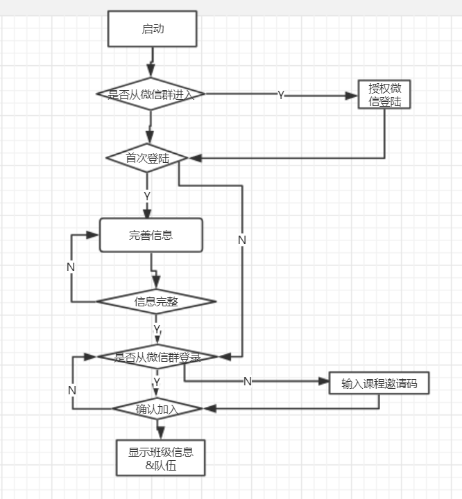
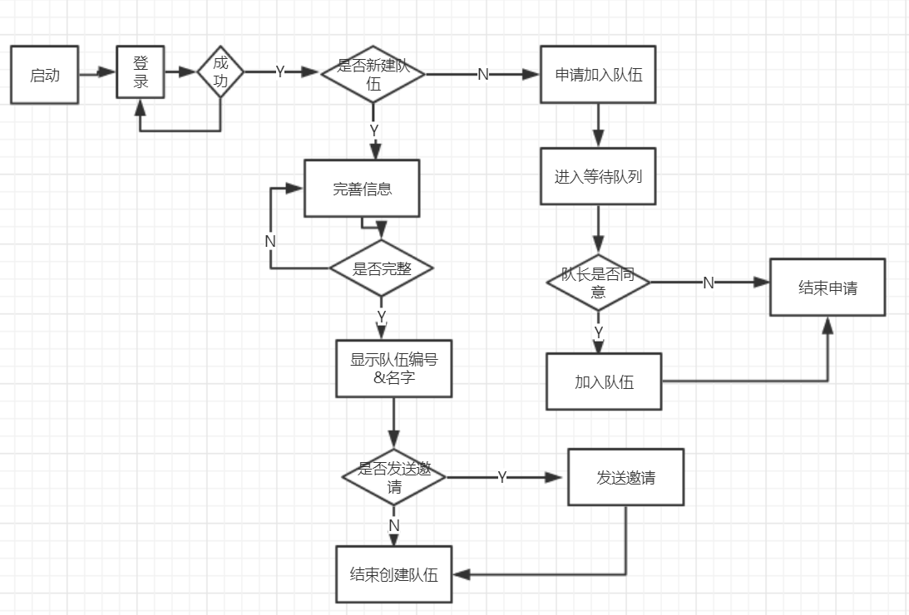
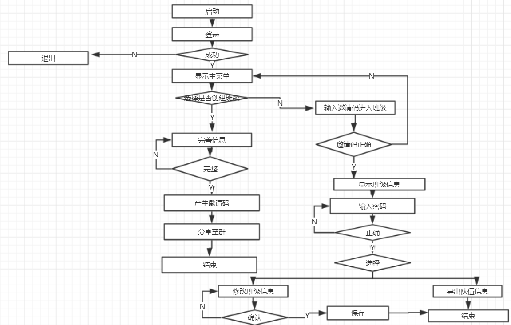
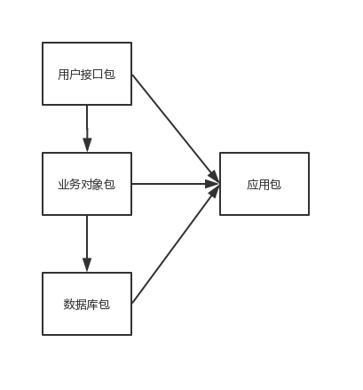
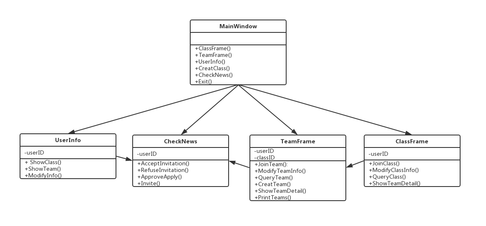
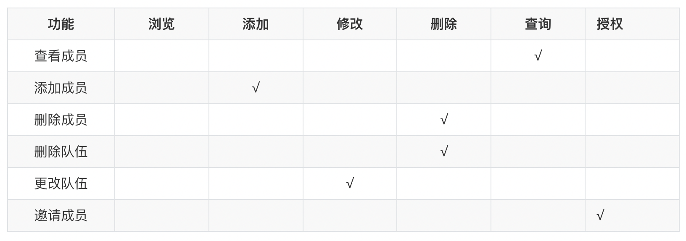
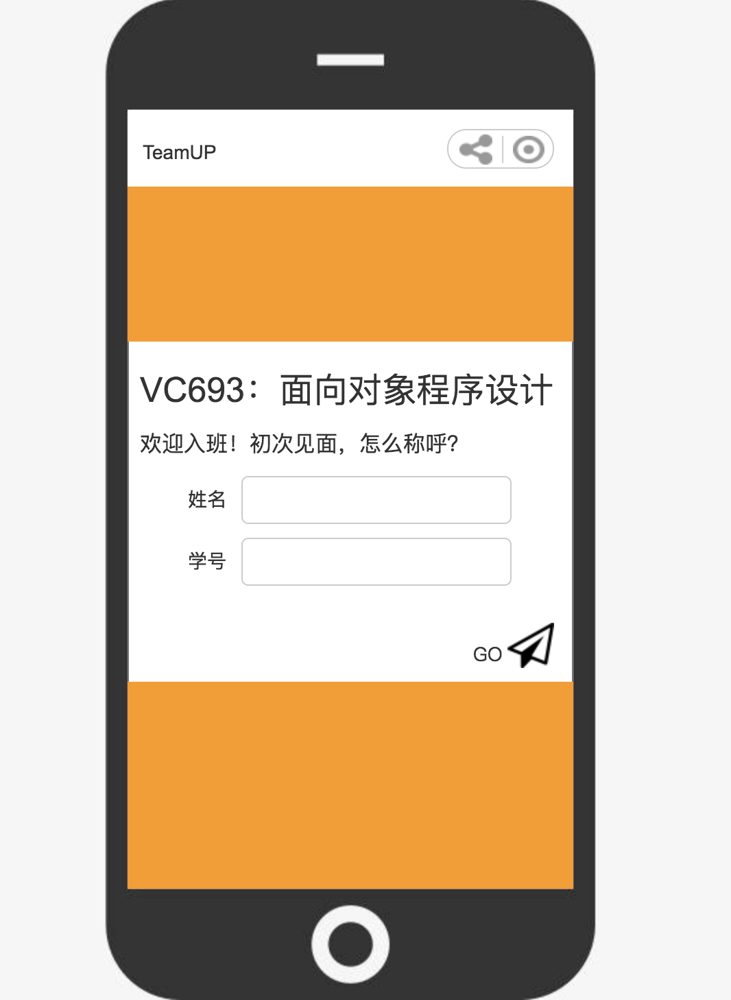
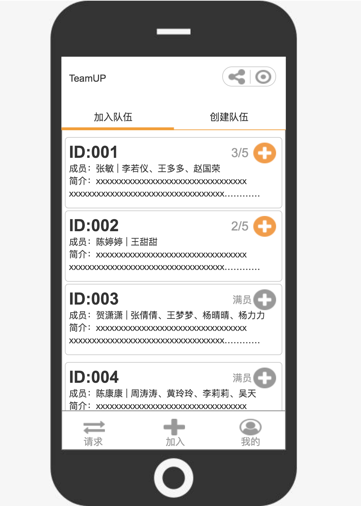
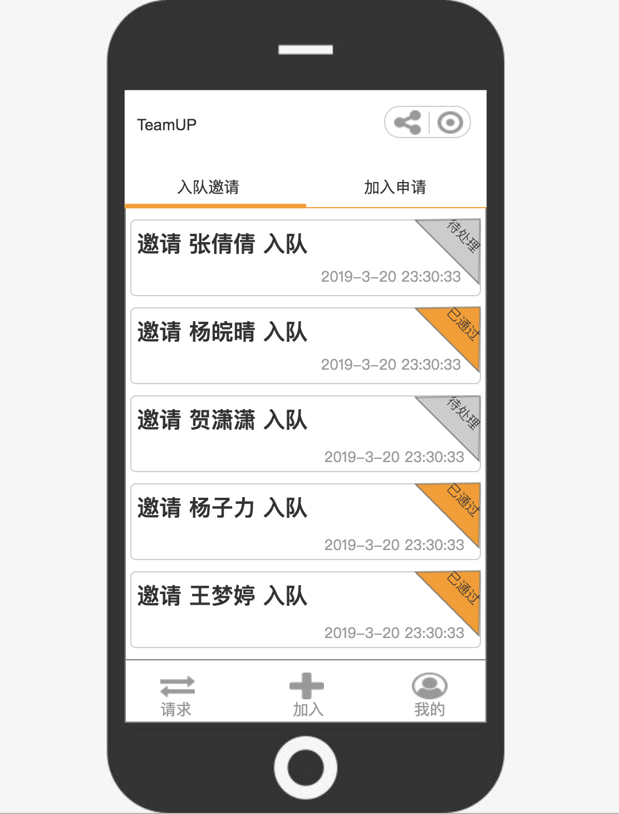

# 总体设计报告

**撰写人**

##### 	陈洁婷 2016202134

##### 	杨子力 2016202100

##### 	张    倩 2016202127

##### 	贺潇潇 2016202227

##### 	王梦婷 2016202308

##### 	杨皖晴 2016202111

**审核人**	：陈洁婷

**演讲者姓名**	：贺潇潇

**日期**	：2019-04-25

## 一、引言

#### 1.1 编写目的：

​	此报告的编写目的是：确定组队小程序的总体设计、确定小程序结构、模块、接口等设计，为后续设计与实现奠定基础。

#### 1.2 项目背景：

- 项目名称：课堂组队小程序

- 项目应用范围：高校课堂

- 项目开发者：软工6组

- 项目目标用户：高校学生及老师助教

#### 1.3 参考资料：
《需求分析规格说明书》
《软件工程文档案例-图书管理系统》

## 二、任务概述

#### 2.1 目标

​	我们的系统核心功能是为用户提供一个组队的平台。
​	用户可以通过系统新建小组并且邀请未组队的用户加入，也可以查看已有队伍的组队情况并且申请加入。对于知晓口令的教师、助教而言，他们可以进行修改班级的分组要求、导出分组情况表等操作。
​	相应的需求有：

1. 能够存储用户信息与队伍信息，并提供有效的更新和显示工作，这主要包括：
  1. 学生、队伍信息的录入、删除与修改。
  2. 学生、队伍信息的检索与查询。
  3. 学生创建队伍、加入队伍及退出队伍。
  4. 老师助教信息的录入、删除与修改。
2. 能够对需要的结果继续统计并打印输出。
3. 提供一定的安全机制，防止数据出现不一致。提供数据的授权访问，防止随意修改，提供备份操作，防止数据出现丢失的情况。
####2.2运行环境

####2.3需求分析
| **主体**   | **场景**   |    |
|:----:|:----|
| 高校学生   | 由于许多课程实验需要团队配合完成，因此学生需要在课下进行组队。学生希望在组队过程中实时掌握队伍动态，并有一个统一且方便的系统对队伍情况进行查看、组建队伍以及完成队伍的后续管理。 |    |
| 老师助教   | 负责进行队伍管理的老师与助教需要了解学生的组队情况与队伍状态，需要通过组队详情了解到队伍的成员信息，需要对全体队伍进行管理。   |    |
| **问题**   | **组队小程序解决方案**   | **开发优先级**   |
| 组队不便   | 提供课堂组队平台（创建队伍、邀请成员、申请加入、通过申请）   | 1   |
| 队伍信息查询不便   | 保留队伍信息，队伍状态及信息可随时查看   | 1   |
| 队伍信息修改不便   | 队长与老师助教可以对队伍信息就行修改   | 2   |
| 信息通知不便   | 老师助教可向队伍发布通知与公告   | 3   |
| 队伍管理不便   | 队长、老师助教可对队伍进行一定管理   | 3   |

#### 2.4条件与限制

​	要求使用人员掌握微信及微信小程序的基本操作，小程序内部会对使用方法及注意事项进行详细的说明。

## 三、总体设计

#### 3.1处理流程

1. 学生登录

2. 学生创建/加入队伍

3. 学生处理

（4）管理员操作

#### 3.2整体设计

1. 总体结构
	
2. 用户接口
3. 
3. 业务对象
	

#### 3.3功能分配

1. 老师/助教/活动发起者

|   功能   |      浏览     |      添加        |      修改        |      删除        |      查询        |      授权        |
|:----:|:----:|:----:|:----:|:----:|:----:|:----:|
|      查看队伍        |    |      |    |    |   √   |    |
|      创建队伍        |    |   √   |    |    |    |    |
|      更改队伍        |    |      |   √   |    |    |    |
|      删除队伍        |    |    |    |   √   |    |    |

2. 队长
 

|   功能   |      浏览 |      添加        |      修改        |      删除        |      查询        |      授权        |
|:----:|:----:|:----:|:----:|:----:|:----:|
|      查看成员        |    |    |    |    |   √   |    |
|      添加成员        |    |   √  |    |    |    |    |
|      删除成员        |    |    |  |   √   |    |    |
|      删除队伍        |    |    |    |   √   |    |    |
|      更改队伍        |    |    |   √   |    |    |    |
|      邀请成员        |    |    |  |  |    |   √   |

3. 队员
 

|   功能   |      浏览 |      添加        |      修改        |      删除        |      查询        |      授权        |
|:----:|:----:|:----:|:----:|:----:|:----:|
|      查看成员        |    |  |    |    |   √   |    |
|      退出队伍        |    |    |    |   √   |    |    |
|      邀请成员        |    |  |  |  |    |   √   |
|      申请入队        |    |   √   |  |  |    |  |

## 四、接口设计

#### 4.1 用户界面

我们对主要用户界面进行了设计。

1. 用户登录（班级群内进入+首次登陆情况）
  
2. 加入队伍
  
3. 创建队伍并邀请成员
  

4. 请求信息
  

#### 4.2内部接口
​	模块间采取数据耦合方式，通过参数表传递数据，交换信息。

## 五、其他设计

#### 5.1数据结构设计——逻辑结构

1. 用户表

| 字段名   | 数据类型   | 长度   | 字段意义   |
|:----|:----|:----|:----|
| userID   | int   |    |    |
| userName   | char   | 15   | 用户名   |
| password   | char   | 8   | 登录密码   |

2. 班级表

| 字段名   | 数据类型   | 长度   | 字段意义   |
|:----|:----|:----|:----|
| classID   | int   |    |    |
| className   | char   | 15   | 课程名称   |
| managePassword   | char   | 8   | 班级管理口令   |

3. 队伍表

| 字段名   | 数据类型   | 字段意义   |
|:----|:----|:----|
| teamID   | int   |    |
| teamLeader   | int   | 队伍组长   |
| classID   | int   | 所属班级   |

4. 队伍-成员

| 字段名   | 数据类型   | 字段意义   |
|:----|:----|:----|
| teamID   | int   |    |
| userID   | int   |    |

5. 班级-学生

| 字段名 | 数据类型 | 字段意义 |
|:----|
| classID | int |    |
| userID | int |    |

6. 通知公告表

| 字段名   | 数据类型   | 长度   | 字段意义   |
|:----|:----|:----|:----|
| notifyID   | int   |    |    |
| senderID   | int   |    |    |
| receiverID   | int   |    |    |
| content   | char   | 50   | 公告内容   |

7. 申请消息表（申请加入某队）

| 字段名   | 数据类型   | 字段意义   |
|:----|:----|:----|
| applicationID   | int   |    |
| senderID   | int   |    |
| teamID   | int   |    |
| status   | int   | 该申请是否已通过（0/1）   |

8. 邀请消息表（邀请某人加入队伍）

| 字段名   | 数据类型   | 字段意义   |
|:----|:----|:----|
| inviteID   | int   |    |
| teamID   | int   |    |
| receiverID   | int   |    |
| status   | int   | 该邀请是否被接受（0/1）   |

#### 5.2数据结构设计——物理结构

本系统内所使用的每个数据结构中的每个数据项均以数据库表的形式存储在数据库中。

#### 5.3数据结构设计——数据结构与程序的关系

数据的录入、修改、删除、统计都要涉及记录结构定义；数据的查询涉及多个数据文件之间的关系；错误信息结构为显示错误信息带来方便。

#### 5.4出错处理设计

1. 出错输出信息
	​         根据不同的错误提供不同的错误信息。如登录出错时显示“账号或密码错误”、“服务器出 
	​    错，请重新登录”；新建小组出错时时显示“您在该班级已组队”、“队伍人数超出人数限制”等。
2. 出错处理对策
	1. 一般错误：显示错误信息，提示用户重新操作。如登录失败、创建班级、创建小组出错等。
	2. 严重错误：重新启动，必要时启动备份恢复数据。如进程被非正常终止、服务器出错等。

#### 5.5安全保密设计

1. 提供用户登录机制；
2. 提供口令机制：用户在创建班级时可设置口令用于更改班级的组队要求等信息，该口令只有班级创建者及其认可的管理员知晓。

#### 5.6维护设计

​	可以在软件交付后根据用户反馈意见修改模块功能。